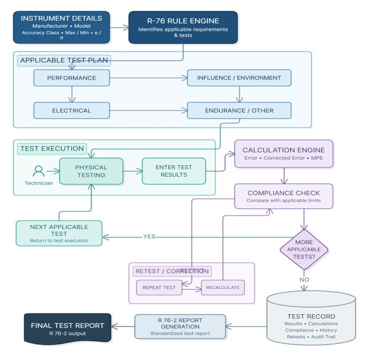
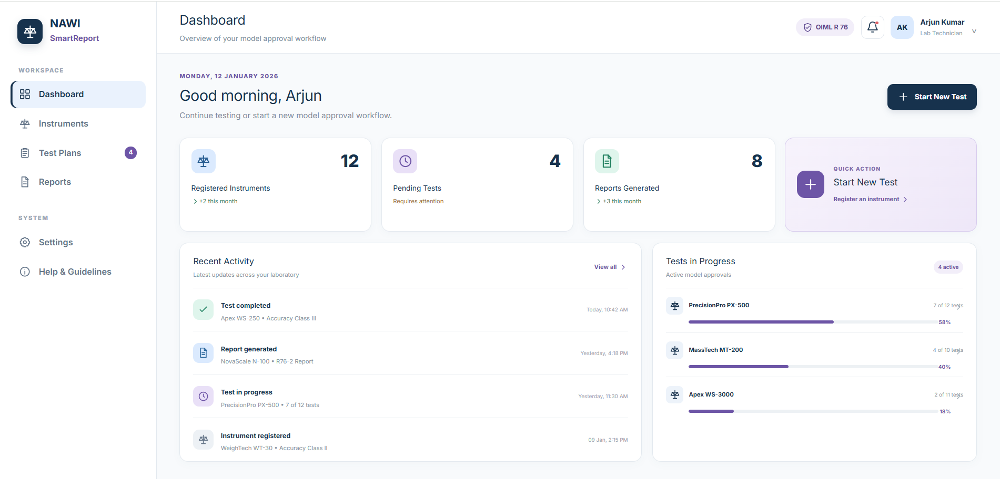
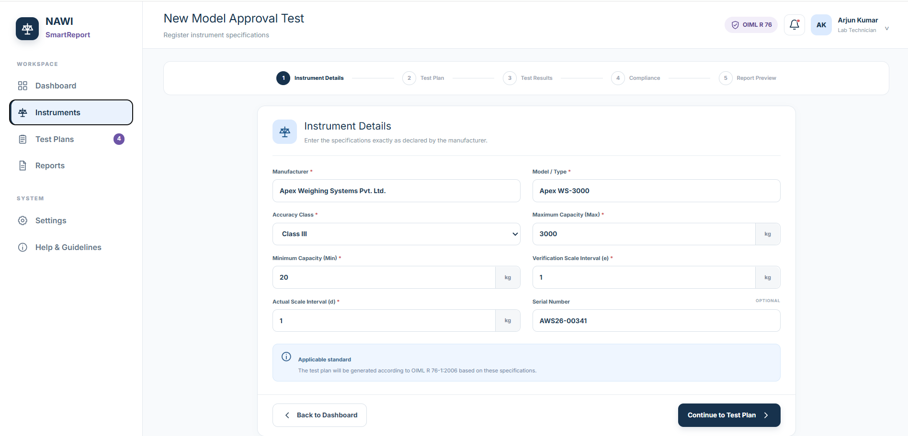
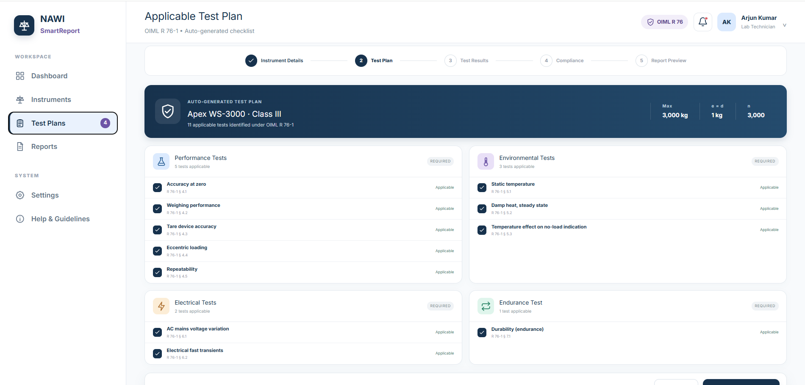
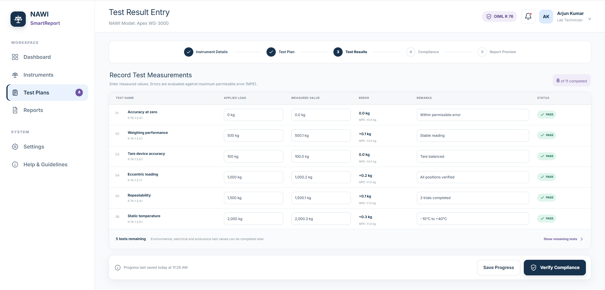
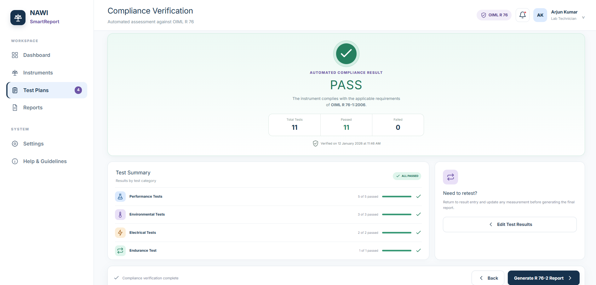
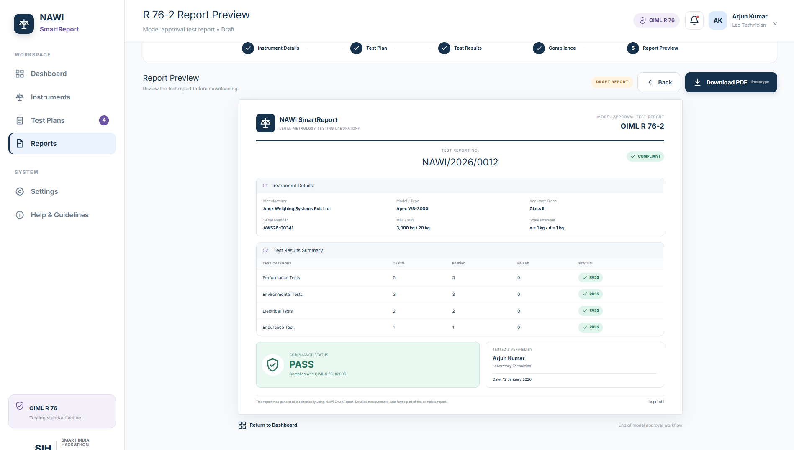

# NAWI SmartReport Prototype

> A UI prototype for automating the **Non-Automatic Weighing Instrument (NAWI)** model approval testing workflow based on **OIML R 76**.

---

## Overview

NAWI SmartReport is a **Smart India Hackathon (SIH) 2026** prototype that demonstrates how the model approval testing process for Non-Automatic Weighing Instruments can be simplified through a guided digital workflow.

Instead of relying on manual calculations and lengthy documentation, the prototype illustrates how technicians can identify applicable tests, record observations, verify compliance with **OIML R 76**, and generate a standardized **R 76-2** report.

> **This repository showcases the UI prototype and user journey. It is intended to demonstrate the proposed solution and workflow rather than the complete production implementation.**

---

## Interactive Prototype

**Figma Prototype:**

`https://poster-cover-00434339.figma.site/`

---

## Problem Statement

The current model approval process involves multiple manual steps, including:

* Identifying applicable tests
* Recording observations
* Performing calculations
* Verifying compliance
* Preparing reports

These tasks increase documentation effort and create opportunities for calculation and reporting errors.

---

## Proposed Solution

The prototype demonstrates a structured workflow where technicians can:

* Register instrument details
* View applicable R-76 tests
* Enter test observations
* Review compliance results
* Preview the generated R 76-2 report

---

## Prototype Workflow

Dashboard → Instrument Details → Applicable Test Plan → Test Result Entry → Compliance Verification → R 76-2 Report Preview

### Workflow Diagram




---

## Prototype Screens

### Dashboard



### Instrument Details



### Applicable Test Plan



### Test Result Entry



### Compliance Verification



### R 76-2 Report Preview



---

## Screen Summary

| Screen                  | Purpose                               |
| ----------------------- | ------------------------------------- |
| Dashboard               | Home screen and quick actions         |
| Instrument Details      | Register the weighing instrument      |
| Applicable Test Plan    | Display generated R-76 test checklist |
| Test Result Entry       | Record measurements and observations  |
| Compliance Verification | Display PASS/FAIL outcome             |
| Report Preview          | Preview the R 76-2 report             |

---

## Repository Structure

```text
NAWI-SmartReport-Prototype/
│── README.md
│── LICENSE
│── CHANGELOG.md
│
├── prototype/
│   ├── figma-link.md
│   ├── dashboard.md
│   ├── instrument-details.md
│   ├── test-plan.md
│   ├── test-results.md
│   ├── compliance.md
│   ├── report-preview.md
│   ├── dashboard.png
│   ├── instrument-details.png
│   ├── test-plan.png
│   ├── test-results.png
│   ├── compliance.png
│   └── report-preview.png
│
├── docs/
│   ├── workflow.md
│   ├── workflow.png
│   ├── prototype-overview.md
│   ├── roadmap.md
│   └── prototype-design-guide.md
│
└── assets/
    └── ui-icons/
```

---

## Design Goals

The prototype focuses on demonstrating:

* A simple technician workflow
* A clean laboratory-style interface
* Guided step-by-step testing
* Digital report generation
* Consistent and user-friendly navigation

---

## Future Scope

* Complete R-76 rule engine
* Automatic calculations
* PDF report generation
* Test history management
* Multi-user laboratory support
* Audit trail for retests and corrections

---

## Developed For

**Smart India Hackathon (SIH) 2026**

NAWI SmartReport is a prototype created to demonstrate how a structured digital workflow can improve NAWI model approval testing while aligning with **OIML R 76** requirements.
